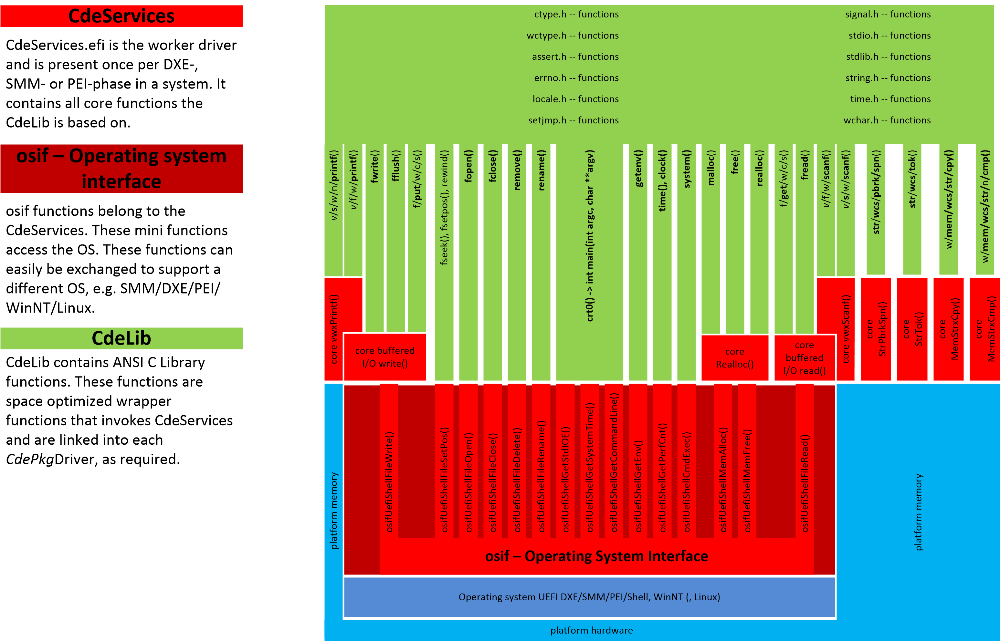

# EDK2020-MinnowBoard featuring CdePkg (C Development Environment Package)
Get the MinnowBoard running with EDK2020 and VS2019 
C Development Environment Package for EDK2. This is a SubModule for the EDK2020-MinnowBoard project only. 

* [Preface](README.md#preface)
* [Introduction](README.md#introduction)
* [Intention](README.md#intention)
* [Implementation](README.md#implementation)
	* [Interface architecture](README.md#interface-architecture)
	* [CdeLoadOptions/command line](README.md#cdeloadoptions--command-line)
	* [Boot flow architecture](README.md#boot-flow-architecture)
* [Status](README.md#status)
	* [todo](README.md#todo)
* [Howto](README.md#howto)
* [Related Projects](README.md#related-projects)
* [Revision history](README.md#revision-history)

<!--  -->

C Development Environment Package for EDK2
## Preface
The programming language C is standardized by the American National Standards Institute (ANSI) and the
International Organization for Standardization (ISO) first in 1989 and 1990.
The latest publicly available version of the standard from 1999 is to be found here: [C99](http://www.open-std.org/JTC1/SC22/WG14/www/docs/n1256.pdf).
The original [ANSI C](https://www.pdf-archive.com/2014/10/02/ansi-iso-9899-1990-1/ansi-iso-9899-1990-1.pdf), also known as C89 or
C90 is not officially available anymore for free.

Both, the *language* (operators, expressions, declarations, specifiers, e.g. `if`, `while`,
`+`, `&&`, `unsigned`, `char`, `struct` ...) and the *library* (functions, parameters, structures, macros, 
e.g. `NDEBUG`, `CLOCKS_PER_SEC`, `raise()`, `scanf()`, `struct lconv`, `struct tm`, `errno` ...) are specified in this document (chapters 6 and 7)
and are obligatory for an implementation that claims to meet the standard.

In a particular C compiler / C library implementation both are completely coordinated to 
each other.

The Microsoft C/C++ compiler and its library LIBCMT.lib is an implementation of this standard;
it is primarily designed to create C/C++ programs and drivers for the Windows Operating System; 
it is surely the most frequently used C compiler of them all and continuously enhanced, updated and
maintained by Microsoft.

This compiler is not a stand alone executable that simply translates C/C++ sourcecode to object 
modules. It is closely entwined with different build environments (WDK/DDK, SDK) consisting of libraries,
headerfiles, the operating system interface and platforms (x86-64/32, ARM64/32) to meet required code safety, code optimization 
(size vs. speed in different shades) and maintainability (e.g. for debug and trace purpose).

The code generation and optimization aspects are not completely documented by Microsoft
but the Microsoft compiler tends to produce machine code, that relies on the presence of
C library specified functions for storage space initialization, comparison and duplication 
(`memset()`,`strcpy()`, `strcmp()`). Additionally some still undocumented function calls
are produced by  the x86-32 code generator, when dealing with 64 bit integer types (`long long`),
that came into the C language standard in 1999.

## Introduction
**CdePkg**, C Development Environment Package, introduces the use of ***Hosted Environment***,
as specified by ANSI C, for both UEFI POST and SHELL drivers.
This is a reference implementation only, using the Microsoft C compiler, linker, library 
manager and IDE that comes with Visual Studio 2019 for x86 platforms.

A *Hosted Environment* for command line applications is standard, its introduction for drivers is a **novum**. This also applies for the UEFI environment. But the wealth of computing power of current UEFI machines offers the chance to translate ANSI C
compatible sourcecode to run as UEFI POST driver.

With the growing complexity of firmware due to the requirements for both security and trust and the
need for speed in development, use of platform-independent sourcecode allows:
* reuse of validated C sourcecode (from different origins, e.g. the open source community)[1](https://github.com/KilianKegel/CdePkg/blob/master/footnotes/footnote-1.md)
* crossdevelopment of complex firmware code on non-UEFI platforms with superb build and debug capabilities
* use of static code analysis tools[2](https://github.com/KilianKegel/CdePkg/blob/master/footnotes/footnote-2.md)
* appraisal of the source code quality by human professionals[3](https://github.com/KilianKegel/CdePkg/blob/master/footnotes/footnote-3.md)

Since the UEFI "OS" interface (DXE/SHELL/SMM and PEI) can be accessed directly by the compiler-translated sourcecode and UEFI provides an independent set of functions, macros and type definitions, ANSI C and UEFI "OS" specific sourcecode can coexist seamlessly. 
This allows a functional ANSI C prototype to adjust successively to real world driver requirements in the UEFI environment. 
A UEFI SHELL application might be an intermediate step for this process if the target is a DXE or SMM driver.

## Intention
**CdePkg** is a feasibility study on how to provide a complete *Hosted Environment* 
(according to ANSI C Specification chapter 5.1.2) including all instrisic functions, 
which the compiler requires to be a **full featured C-compiler**, in particular the full
set of C-language operators (specifically `/`, `%`, `<<`, `>>` for 64 bit integers) for the 32 bit code generator, needed in PEI.

Furthermore the questions has to be answered, if UEFI based products can be improved regarding
* software quality (in terms of number of required updates during a life cycle)
* development time
* feature set (complexity and quantity)
* storage space needed in a flash part (the smaller the better)

...if a standardized programming interface as ANSI C is available, in conjunction with a storage space optimization
strategy, as described below, that splits *wrapper libraries* from *worker drivers*.

In the UEFI programming environment not even the smallest piece of code can be cross developed on a
different platform, since function names differ in upper/lower case letters, format specifier for
`Print()`-functions differ from C's `printf()`, a `scanf()` counterpart is absent, wideness
of stringtypes differs from corresponding ANSI C functions.

Since in many cases the ANSI C specification allows freedom for a particular library implementation 
(return values, flags, structure layout) but the chosen build and debug environment is VS2019 the original
Microsoft C Library functions had to be recreated, fully compatible, bug for bug (except otherwise noted). 
This would provide the most relieable solution for cross development, enable the use of the original
Microsoft header files and prevent from documenting yet another C Library implementation.

A *Hosted Environment* provides the following obligatory features: 
* [`int main(int argc,char **argv)`](https://docs.microsoft.com/en-us/cpp/c-language/main-function-and-program-execution?view=vs-2019) is the driver entry point[4](https://github.com/KilianKegel/CdePkg/blob/master/footnotes/footnote-4.md)
* `argc` and `argv` are used for parameter passing, in **CdePkg** also for POST drivers https://docs.microsoft.com/en-us/cpp/c-language/parsing-c-command-line-arguments?view=vs-2019
* full blown ANSI C library
* buffered I/O, that means that [`ungetc()`](https://docs.microsoft.com/en-us/cpp/c-runtime-library/reference/ungetc-ungetwc?view=vs-2019) works on streams, beside an improvement in speed
* [`exit()`](https://docs.microsoft.com/en-us/cpp/c-runtime-library/reference/exit-exit-exit?view=vs-2019) invocation on driver termination, that implies
    * run [`atexit()`](https://docs.microsoft.com/en-us/cpp/c-runtime-library/reference/atexit?view=vs-2019)-registered functions
    * free allocated memory 
    * remove all tempfiles (not applicable for POST drivers)
    * close open files (not applicable for POST drivers)

The command line parameter / load options for each *CdePkg*Driver shall be able to be adjusted
on a final system without recompiling the BIOS and updating the BIOS chip.
This e.g. allows the support engineer to change BIOS behaviour on a (partially)
defect system for repair/debug mode, enabling trace messages, excluding special
(non-compliant) devices from beeing enumerated. 

## Implementation
**CdePkg**'s functionality is composed of three components:
  1. the C Library **CdeLib**
  2. the service driver **CdeServices**
  3. the POST command line reference implementation [**CdeLoadOptions**](CdePkg/CdeLoadOptionsDxe)

all in 32 and 64 bit variants for DXE, SMM and PEI each.

**CdeLib** and **CdeServices** are highly optimized for space minimized appearance of 
ANSI C library functions in the UEFI drivers. This is achieved by implementing all-embracing worker functions

* `printf()`-family core
* `scanf()`-family core
* `realloc()` core (`malloc()`, `free()`, `realloc()` and `calloc()`)
* `strcmp()`-family core (all `str`/`wcs`/`mem` `n` `i` functions)
* `strcpy()`-family core (all `str`/`wcs`/`mem` `n` functions)
* `strpbrk()`/`strspn()` -family core (all `str`/`wcs` `pbrk`- and `spn`- functions)
* `strtok()`-family core (all `str`/`wcs` `tok`-functions)
* CRT0 startup code for DXE, SMM, PEI
* buffered I/O core (`fread()`, `fwrite()` and `ungetc()`)
* locale character tables
* interface functions to access DXE- and PEI-API

in the **CdeServices** driver, that resides once in DXE-, SMM- and PEI-phase each.
The **CdeLib** just provides small wrapper functions that invoke **CdeServices**.

### Interface architecture

### **CdeLoadOptions** / command line
Each *CdePkg*Driver reports its EfiCallerIdGuid while running through CRT0 to **CdeLoadOptions**.
**CdeLoadOptions** provides a pointer to the matching "Command Line" from an simple EfiCallerIdGuid/CommandLine table
within the file [`CdeLoadOptions.h`](/CdePkg/Include/CdeLoadOptions.h), 
compiled into the [**CdeLoadOptions**](CdePkg/CdeLoadOptionsDxe/CdeLoadOptionsDxe.c) driver binary.

**This is just a proof of concept. In a real implementation, as mentioned above, the command line can be
changed without recompilation and BIOS update.**

### Boot flow architecture

The Boot flow sequence consists of: 

1. PEI CdeLoadOption (to provide the commandline to PEI drivers)
2. PEI CdeServices (to provide the space optimized worker functions)
3. PEI custom drivers (CdeServicesPei-based)
4. DXE CdeLoadOption (to provide the commandline to DXE drivers)
5. DXE CdeServices (to provide the space optimized worker functions)
6. DXE custom drivers (CdeServicesDxe-based)
7. BDS custom drivers
8. UEFI Shell drivers (CdeServicesDxe-based, yet still Torito-C-Library-based)

## Status
The **CdeLib** and **CdeServices** are derived from their companion project 
[Torito C Library](https://github.com/KilianKegel/torito-C-Library) but
split into *wrapper*/*worker* architecture. (Internally [Torito C Library](https://github.com/KilianKegel/torito-C-Library)
was designed from the very beginning for that splitted architecture, but  library and driver were merged into one executable, to
run on platforms without **CdeServices** protocol.)

The functions below are already implemented and tested, every single one of them, except otherwise noted:

[List of available functions](implemented.md)

[Torito C Library](https://github.com/KilianKegel/torito-C-Library#torito-c-library) has passed extensive
tests to verify Microsoft's C Library compatibility and is also approved in various real world applications.
Therefore the **CdePkg**'s C library will be validated by simple tests only, in the [CdeValidationPkg](CdeValidationPkg/README.md#cdevalidationpkg), for DXE, SMM and PEI respectively.

### todo
* add simple UART based (COM1) CON I/O interface since consoles are not supported during POST
* add SMM support
* 20190714 <del>add PEI support</del>
* move CRT0 startup code to **CdeServices**
* move local character tables to **CdeServices**
* move buffered I/O core to **CdeServices**
* validate functions in DXE, SMM and PEI [List of available functions](implemented.md#validation-status)
* complete library implementation

[todo reminder](todoreminder.md)

## Howto
1. install a build machine: https://github.com/KilianKegel/HowTo-setup-an-UEFI-Development-PC#howto-setup-an-uefi-development-pc
    * VS2015x86 tool chain is used. Make sure, that **MSVC v140 VS2015 build tools** are installed
2. `git clone -b CdePkg --recursive https://github.com/tianocore/edk2-staging.git`
3. run **LAUNCH.BAT**, that will
    1. check build tools are installed
    2. download NASM and OPENSSL tools
    3. download EDK2 and EDK2-NON-OSI from tianocore and CdeBinPkg
    4. setup the build environment variables
4. build the source tree:
    * For MINNOWBOARD BUILD type: `build -a IA32 -a X64 -n 5 -t VS2015x86 -b DEBUG -p PlatformPkgX64.dsc`
    * For  EMULATION  BUILD type: `build -p EmulatorPkg.dsc -t VS2015x86 -a IA32`
5. build the CdeBinPkg source tree:
    * NOTE: CdeBinPkg CdeServices driver and CdeLib library are provided in binary format per default
      but can be recreated within a VS2019 session 
      To do so, start CdeBinPkgSrc.sln with VS2019
6. Emulation Build run/debug
    * run: `runemu.bat`
    * debug: `dbgemu.bat` 
      NOTE: To use `__debugbreak()` the debug engine (VS2019) must be connected to the process *before*
            the breakpoint is reached.

7. Create and debug a new **CdePkg** driver 
   The [CdeValidationPkg](CdeValidationPkg/README.md#cdevalidationpkg) can be used
   to create and debug **CdePkg**-based drivers 
   ATTENTION: Only a small number of ANSI C library [functions are yet validated](implemented.md)

## Related Projects
| related project|annotation|
|:-|:-|
|[Torito C Library](https://github.com/KilianKegel/torito-C-Library#torito-c-library)|C Library for UEFI Shell only. All projects below are built on or derived from *Torito C Library*|
|[Visual ANSI C for UEFI Shell](https://github.com/KilianKegel/Visual-ANSI-C-for-UEFI-Shell#visual-ansi-c-for-uefi-shell)|Getting started with Visual Studio for UEFI Shell and ANSI C cross-development.
|[Visual DOS Tools for UEFI Shell](https://github.com/KilianKegel/Visual-DOS-Tools-for-UEFI-Shell#visual-dos-tools-for-uefi-shell)|more, find command implementation|
|[Visual HWTools for UEFI Shell](https://github.com/KilianKegel/Visual-HWTools-for-UEFI-Shell#visual-hwtools-for-uefi-shell)|HWTools: PCI- and GPIOSpy for Baytrail. MemSpy for all.|

## Revision history
### 20200202
* move from [tianocore](https://github.com/tianocore/edk2-staging/tree/CdePkg) to my private account 

### 20191202
* add ASSERT.H and LOCALE.H function validation for EmulationMode and MinnowBoard for PEI and DXE POST drivers
* assert(), setlocale(), localeconv()

### 20191129
* add CTYPE.H and WCTYPE.H function validation for EmulationMode and MinnowBoard for PEI and DXE POST drivers
* isalnum(),isalpha(),iscntrl(),isdigit(),isgraph(),islower(),isprint(),ispunct(),isspace(),isupper(),isxdigit(),tolower(),toupper()
* iswalnum(),iswalpha(),iswblank(),iswcntrl(),iswdigit(),iswgraph(),iswlower(),iswprint(),iswpunct(),iswspace(),iswupper(),iswxdigit(),iswctype(),wctype(),towlower(),towupper(),towctrans(),wctrans()

### 20191127
* add STDLIB.H function validation for EmulationMode and MinnowBoard for PEI and DXE POST drivers
* atoi(), atol(), strtol(), strtoul(), rand(), srand(), calloc(), free(), malloc(), realloc(), atexit(), exit(), qsort(), abs(), labs(), div(), ldiv()
* not available for POST drivers: abort(), strtod(), atof(), getenv(), system(), bsearch()

### 20191126
* add STDIO.H function validation for EmulationMode and MinnowBoard for PEI and DXE POST drivers
* tmpnam(), printf(), snprintf(), sprintf(), vsnprintf(), vsscanf(), sscanf(), vprintf(), vsprintf()
* NOTE: file access and locale dependent functions are not available for POST drivers.

### 20191125
* add WCHAR.H function validation for EmulationMode and MinnowBoard for PEI and DXE POST drivers
* wprintf(), swprintf(), vswprintf(), wcscpy(), wcsncpy(), wcscat(), wcsncat(), wcscmp(), wcsncmp(), 
  wcschr(), wcscspn(), wcspbrk(), wcsrchr(), wcsspn(), wcsstr(), wcstok(), wcslen(), 
  wmemcmp(), wmemcpy(), wmemmove(), wmemset()
* NOTE: file access and "locale" dependent functions are not available for POST drivers.

### 20191119
* add STRING.H function  validation for EmulationMode and MinnowBoard 
  memcpy(), memmove(), strcpy(), strncpy(), strcat(), strncat(), memcmp(), strcmp()
  strncmp(), memchr(), strchr(), strcspn(), strpbrk(), strrchr(), strspn(), strstr()
  strtok(), memset(), strerror() and strlen()
* not implemented are strcoll() and  strxfrm() that are locale dependant that
  is not yet supported

### 20191111
* add all remaining TIME.H function validation for EmulationMode and MinnowBoard 
  difftime(), mktime(), time(), asctime(), ctime(), gmtime(), localetime(), strftime()
* TIME.H functions are fully available for UEFI POST (PEI and DXE)

### 20191108
* add TIME_H\clock() function validation for EmulationMode and MinnowBoard
* add Torito C Library sourcecode selection to build **CdePkg** driver and libraries

### 20191028
* update to meet offical EDK2-STAGING requirements
  * remove binary driver
  * remove binary library
  * simplify PACKAGE_PATH related components

### 20191023
* initial revision
